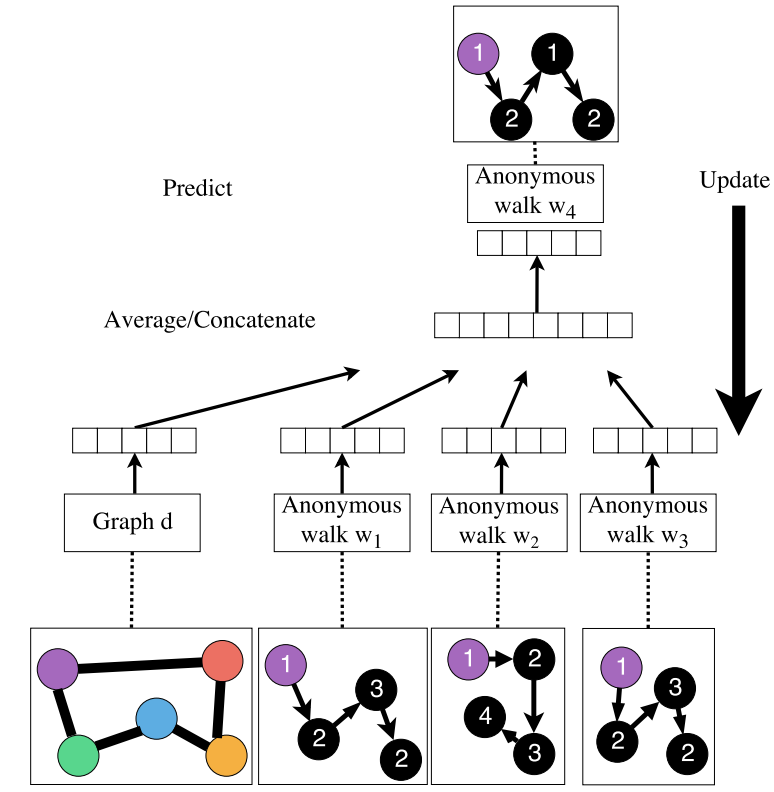
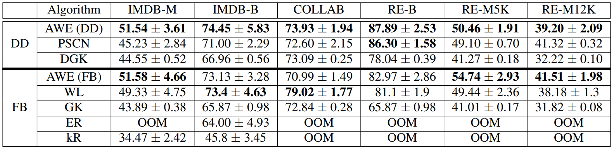
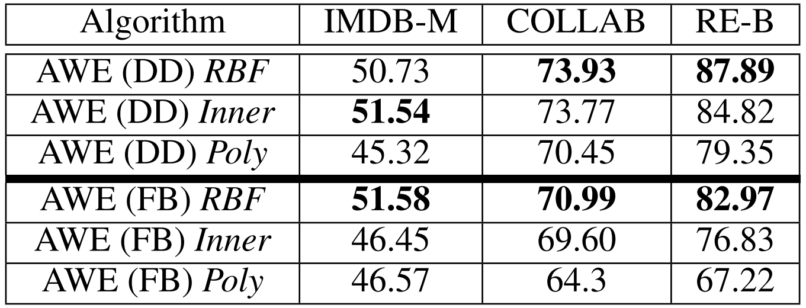
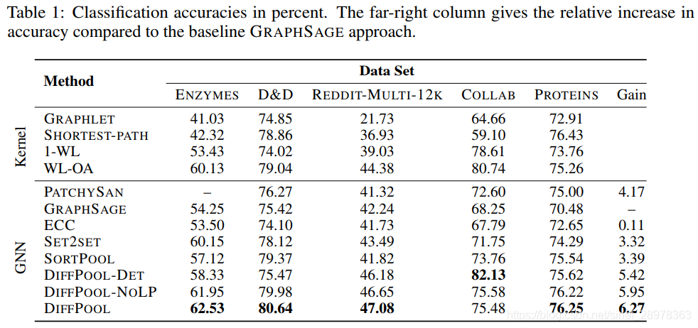

# 图神经网络相关文献综述

## 1 Semi-Supervised Classification With Graph Convolutional Networks

- 任务：对图上数据结构的**半监督**学习
  - 任务具体描述：对Graph **G = (V, E)**上的**N**个nodes $v_i \in V$进行分类，但是**仅有一小部分**nodes有labels(是标注数据)
  - 任务涉及的符号：$X_i$为**node i**的**feature vector**,$X = [X_1,...,X_n]$为图的结点特征矩阵，$A$为图的邻接矩阵，**$D = diag(D_{ii}), D_{ii} = \sum_{j}A_{ij}$**为图的度数矩阵

- 方法：使用神经网络模型$f(X,A)$对所有带标签结点进行supervised learning的训练
在图的邻接矩阵上调整$f(\cdot)$使得模型可以从supervised loss $L_0$分配梯度信息，学习所有nodes的表示
    - 神经网络结构
      </img>
        - 输入：C个input channel,每个结点$v_i$特征向量$X_i \in R^C$
        - 中间：若干隐藏层
        - 输出：F个feature maps,每个结点$v_i$的输出为一个F维向量，$Y_i$为结点$v_i$的标签
    - 隐藏层的分层传播规则：$H^{(l + 1)} = \sigma(\tilde{D}^{-\frac{1}{2}}\tilde{A}\tilde{D}^{-\frac{1}{2}}H^{(l)}W^{(l)})$
      - 参数和传播
        - 传播范围：输入$\to$下一个隐藏层$\to$下下个隐藏层$\to$...$\to$输出层
        - $\tilde{A} = A + I_N$是无向图$G$加上自连接后的邻接矩阵
        - $\tilde{D_{ii}} = \sum_j \tilde{A_{ij}}$,$W^{(l)}$是layer-specific
        - $\sigma(\cdot)$是activation function,$H^{(l)}$是第$l$层activation function的输出矩阵，$H^{(0)} = X$
        - 这个传播规则可以通过**谱图卷积的局部一阶近似**来实现传播
      - **谱图卷积**
        - 第一种图卷积公式：$g_\theta \star x = U g_\theta U^Tx$
          - 参数：$x$为node的特征向量，$g_\theta = diag(\theta), \theta \in R^N$为卷积核,$\theta$为参数，$U$为图的laplace矩阵$L = I_N - D^{-\frac{1}{2}}AD^{-\frac{1}{2}} = U\Lambda U^T$的特征向量矩阵
          - 这种卷积的问题：复杂度过高，卷积核选取也不合适
        - **改进的卷积公式**：$g_{\theta'}\star x = \sum_{k = 0}^K\theta_k'T_k(\tilde{L})x$,$\tilde{L} = \frac{2}{\lambda_{max}}L - I_N$
          - 切比雪夫多项式
          $T_k(x) = 2xT_{k - 1}(x) - T_{k - 2}(x), T_0(x) = 1, T_1(x) = x$
          - 改进思路：$g_\theta(\Lambda)$可以用切比雪夫多项式$T_k(x)$的$K^{th} order$截断表达式来进行很好的估计$\to$$g_{\theta'}(\Lambda)\approx \sum_{k = 0}^K \theta_k'T_k(\tilde{\Lambda})$,$\tilde{\Lambda} = \frac{2}{\lambda_{max}}\Lambda - I_N$,$\lambda_{max}$是$L$最大的特征值,$\theta' \in R^k$是切比雪夫参数向量
          - 此公式为拉普拉斯算子中的$K^{th}$阶多项式，即它仅取决于**离中央结点最大K步**的结点
          - 通过这个改进的卷积公式，可以**堆叠建立多层卷积层(实现传播规则)**
      - 图谱卷积应用:**线性模型**和**特征映射公式**
        - 线性模型公式:考虑$K = 1, \lambda_{max} = 2$,模型就只有2个参数，即$g_{\theta'}\star x \approx \theta_0'x + \theta_1'(L - I_N)x = \theta_0'x - \theta_1'D^{-\frac{1}{2}}AD^{-\frac{1}{2}}x$
          - 自由参数：$\theta_0',\theta_1'$
          - 连续应用这种形式的filter,就可以有效卷积结点的$k^{th}$邻域， 其中$k$是模型中连续filter操作或卷积层的数目
        - 特征映射公式：feature maps(特征映射)$Z = \tilde{D}^{-\frac{1}{2}}\tilde{A}\tilde{D}^{-\frac{1}{2}}X\Theta$
          - 考虑具有C个input channel(每个结点C维特征向量)的信号$X \in R^{N \times C}$,和$F$个filters，$\Theta \in R^{C\times F}$是filter参数矩阵，$Z \in R^{N\times F}$为卷积信号矩阵，filtering operation复杂度为$O(|E|FC)$

- 优缺点
  - 优点
    - **免除了传统方法中"相连结点应该相似，具有相同标签"这个及其严格的假设**，去除了损失函数中的正则项
    - 简单，表现优越，能通过提出的图谱卷积的局部一阶近似的方法来一个卷积层仅处理一截一阶邻居特征，然后通过分层传播规则叠加多个卷积层来达到多阶邻居特征传播
  - 缺点
    - 半监督时**带label的结点过少**，GCN**性能下降**严重
    - **浅层**GCN网络**不能大范围传播**label信息
    - **深层**GCN网络可能会导致**过度平滑**的问题

## 2 How Powerful are Graph Neural Networks?

- 主要内容
  - 证明**Weisfeiler-Lehman(WL) test图同构测试是GNN表示能力的上限**
  - **给出了一套理论框架**，分析主流GNNs在捕获图结构上的问题
  - 根据理论框架提出**如何构建和WL一样有效的GNN**，并给出了**图同构网络(GIN)**的构建，证明其表达能力和WL测试一样

- 一些概念和定义
  - multiset:允许有重复元素的集合，**本文的multiset指的是结点邻居的特征向量的集合**
  - 符号定义
    - 图:$G = (V, E)$
    - $A$为$G$的邻接矩阵
    - $D = diag(d_1,...,d_n)$为$G$的度数矩阵，$d_i = \sum_jA_{ij}$
    - $y_i \in \{0, 1\}^C$表示$C$维的结点one-hot label
    - $\{G_1,...,G_N\} \sube G$表示一个图的集合
    - $X_v$表示结点$v$的特征向量
    - $h_v$表示需要学习的结点$v$的表示向量
    - $h_G$为图$G$的表示向量
    - $y_G = h(h_G)$表示整个图$G$预测的标签

- GNN概述
  - 目标：以**图结构数据和结点特征作为输入**，学习到**结点/图的表示**，用于分类任务(结点分类或者图分类)
  - 基于邻域聚合的GNN的三个模块
    - **Aggregate**:聚合一阶邻域特征
    - **Combine**:将邻居的特征和当前结点特征**合并**，以**更新**当前结点特征
    - **Readout**:如果对图进行分类，需要将图中所有结点特征转变为图特征
  - k层GNNs的结构表示
    - $a_v^{(k)} = \text{AGGREGATE}^{(k)}(\{h_{u}^{(k - 1)}, u \in N(v)\}), h_v^{(k)} = \text{COMBINE}(h_v^{(k - 1)}, a_v^{(k)})$,$N(v)$表示结点$v$的邻居的集合
  - 分类任务
    - 结点分类：结点在最后一层的表示$h_v^{(K)}$可以用于预测
    - 图分类：要将graph中所有结点特征变成graph特征$h_G = \text{READOUT}(\{h_v^{(K)}|v \in G\})$

- WL test图同构测试
  - 图同构：对图$G_1, G_2$，存在一一映射$f$,将$G_1$的结点集合$V_1$映射到$G_2$的结点集合$V_2$上，且映射后$G_1 = G_2$
  - WL test:通过**不断迭代得到结点新label**来判断同构图的同构性
    - **Aggregate**：聚合每个结点邻域和自身label
    - **Update Label**：使用**Hash映射**结点聚合label作为结点新label
  - WL test举例
  </img>
    - (a) 网络中每个结点有1个label
    - (b) label扩展:做一阶广度搜索，只遍历自己的邻居
    - (c) label压缩：将扩展的label映射为一个新label
    - (d) 压缩label替换扩展label
    - (e) 对label进行计数，label的个数作为网络的新特征

- WL test和GNN
  - **WL test是GNN表示能力的上限**
  引理：令两个图$G_1,G_2$是任意两个**非同构**的图，如果存在一个图神经网络$A: G\to R^d$将$G_1,G_2$映射到不同的embedding，那么通过WL图同构测试也可以确定$G_1,G_2$是非同构的
  - **和WL test能力相同的GNN**
  定理：令$A: G\to R^d$是一个GNN，对于两个通过WL图同构测试测定为**不同构**的两个图$G_1,G_2$,在GNN层足够多的情况下，如果下面情况成立，则通过GNN可以将这两个图映射到不同的embedding：
  (1) $A$用下面的公式迭代来聚合和更新结点特征：
  $h_v^{(k)}= \phi(h_v^{(k- 1)}, f(\{h_u^{(k - 1)}| u \in N(v)\}))$
    - 函数$f$作用在**multisets**上
    - $\phi$函数是单射的

- 图同构网络**GIN**
  - 定理：当$X$可数时，将**Aggregate**设置为**sum**,**Combine**设置为$1 + \epsilon$时，存在$f(x)$使得$h(c, X)$为单射：$h(c, X) = (1 + \epsilon) \cdot f(c) + \sum_{x \in X}f(x), c$为结点特征，$X$为邻域特征集合
  - 推论：$\forall g(c, X)$,可以分解为$f\circ \varphi$形式，满足单射性$\to g(c, X) = \varphi((1 + \epsilon)\cdot f(c) + \sum_{x \in X}f(x))$
  - GIN的结构框架
  通过引入多层感知机MLP来学习$\varphi,f$，保证单射性，最后得到**MLP+SUM**的GIN框架
  $h_v^{(k)} = \text{MLP}^{(k)}((1 + c^{(k)})\cdot h_v^{(k - 1)} + \sum_{u \in N(v)}h_u^{(k - 1)})$
    - MLP可以近似拟合任何函数，因此可以学到单射函数
    - 约束输入特征是one-hot，所以第一次迭代sum后还是满足单射性，不需要做MLP的预处理
    - 迭代一轮的新特征$h_v^{(k)}$可数，经过了$f(x)$转换，下一轮迭代还是满足单射性条件
  - GIN的图分类任务
    - 考虑readout函数，以所有结点的embedding为输入，输出整个图的embedding
    - **READOUT模块**使用**Concat+Sum**，对每次迭代得到的所有结点特征求和得到图的特征，然后拼接起来
    - $h_G = \text{CONCAT}(\text{sum}(\{h_v^{(k)}| v\in G\})| k=0,1,...,K)$

- 优点
  - 从理论上给出了GNN的上限
  - 建立了一套理论框架，能对GNN的表达能力进行分析
  - 设计了图同构网络GIN，达到了GNN表示能力上限

## 3 GRAPH ATTENTION NETWORKS（GAT）

- 主要内容
  - 提出一种GAT（Graph Attention Networks）网络
    - 使用masked self-attention层
      - 根据每个结点在其相邻节点上的attention来对结点表示进行更新
      - 可以根据邻居结点的特征为每个结点分配不同的权值
      - 无需事先知道图的结构
    - 解决了之前基于图卷积（或其近似）模型所存在的问题
    - 可以有效地适用于基于图的归纳学习问题与转导学习问题
    

- Model
  - Graph Attentional Layer
    - 首先说明其输入输出的feature
      - 输入是一个结点特征向量集$\textbf{h} = \{\overrightarrow{h_1}, ..., \overrightarrow{h_N}\}, \overrightarrow{h_i} \in \mathbb{R}^F$。其中N表示结点集中结点的个数，F表示特征向量的维度
      - 输出是一个新的节点特征向量集$\textbf{h}' = \{\overrightarrow{h'_1}, ..., \overrightarrow{h'_N}\}, \overrightarrow{h'_i} \in \mathbb{R}^{F'}$，其中F'表示新的结点特征向量维度（可以不等于F）

    - 其结构如图所示：
      </img>
    - 右图：结点$\overrightarrow{h}_1'$在邻域中具有多端连接，不同的箭头样式表示独立的注意力计算，通过concat（直连）或avg（平均）获取$\overrightarrow{h}_1'$
    - 首先根据输入的结点特征向量集进行self-attention处理：$ e_{ij} = a(\textbf{W} \overrightarrow{h_i}, \textbf{W} \overrightarrow{h_j}) $
    - 其中，a是一个 $\mathbb{R}^{F'} \times \mathbb{R}^{F'} \rightarrow \mathbb{R}$的映射（称作注意力机制），$W \in \mathbb{R}^{F' \times F} $ 是一个权值矩阵（被所有$\overrightarrow{h_i}$所共享）
    - 一般来说，self-attention会将注意力分配到图中所有节点上，这种做法显然会丢失结构信息
    - 为解决这一问题，本文使用一种masked attention的方式：仅将注意力分配到节点i的相邻结点集上，即令 $ j \in \mathcal{N}_i $（本文中默认 $i$ 属于 $ \mathcal{N}_i $ ）（见上面左图）: $ \alpha_{ij} = softmax_j(e_{ij}) = \frac{exp(e_{ij})}{\sum_{k \in \mathcal{N}_i} exp(e_{ik})} $
    - 本文中，计算attention coefficient的函数a使用单层的前馈神经网络实现，使用LeakyReLU作为激活函数，即 $ e_{ij} = LeakyReLU(\overrightarrow{a}^T [\textbf{W} \overrightarrow{h}_i || \textbf{W} \overrightarrow{h}_j]), \\
      \alpha_{ij} = \frac{exp(LeakyReLU(\overrightarrow{a}^T [\textbf{W} \overrightarrow{h}_i || \textbf{W} \overrightarrow{h}_j]))}{\sum_{k \in \mathcal{N}_i} exp(LeakyReLU(\overrightarrow{a}^T [\textbf{W} \overrightarrow{h}_i || \textbf{W} \overrightarrow{h}_k]))}, \\
              （||表示连接），
              其中\overrightarrow{a}^T \in \mathbb{R}^{2F'}为前馈神经网络a的参数\\ $
    - 现在求出了$\alpha_{ij}$，于是就可以得到 $\overrightarrow{h'}_i$：$ \overrightarrow{h'}_i = \sigma(\sum_{j \in \mathcal{N}_i} \alpha_{ij} \textbf{W} \overrightarrow{h}_j) $
  - multi-head attention
    - 为提高模型的拟合能力，引入了multi-head attention机制（见上面右图），即不只用一个函数a来计算attention coefficient，而是设置K个函数，每一个函数都能计算出一组attention coefficient，并能计算出一组加权求和用的系数$\alpha_{ij}$，每一个卷积层中，K个attention机制独立工作，分别计算出结果后连接在一起，得到卷积的结果，即 $ \overrightarrow{h'}_i = \parallel^{K}_{k=1} \sigma(\sum_{j \in \mathcal{N}_i} \alpha_{ij}^k \textbf{W}^k \overrightarrow{h}_j)  $
    - 特别地，如果在最后一层（即prediction layer）中，我们仍然使用multi-head attention机制，那么久不采取连接（concat）的方式来合并不同注意力机制的结果，而是采用求平均（avg）的方式：$ \overrightarrow{h'}_i =  \sigma(\frac{1}{K} \sum^K_{k=1} \sum_{j \in \mathcal{N}_i} \alpha_{ij}^k \textbf{W}^k \overrightarrow{h}_j) $
- 模型比较与模型优点
  - 运行高效
    - 特别地，需进行特征值分解等复杂的矩阵运算，单层GAT的时间复杂度与GCN相同，为$O(|V|FF' + |E|F')$，其中$|V|$和$|E|$分别表示图中的结点数量和边的数量
  - 为每个结点和其每个相邻结点计算attention时可以进行并行计算
  - 相较于GCN，GAT可以按照规则指定neighbor不同的权重，不受邻居数目不同的影响，具有更强的表示能力
  - 对于图中的所有边，attention机制是共享的。因此GAT也是一种局部模型。也就是说，在使用GAT时，我们无需访问整个图，而只需要访问所关注节点的邻节点即可
    - 可以处理有向图（若$i \rightarrow j$ 不存在，仅需忽略 $\alpha_{ij}$ 即可)
    - 可以被直接用于解决归纳学习问题，即可以对从未见过的图结构进行处理
  - GraphSAGE方法通过从每个节点的邻居中抽取固定数量的节点，从而保证其计算的一致性。这意味着我们在对一个结点执行推断时，无法访问其所有的邻居；而GAT是建立在所有邻节点上的，而且无需假设任何节点顺序
  - GAT可以被看作是MoNet的一个特例。具体来说，可以通过将伪坐标函数（pseudo-coordinate function）设为 $O(|V|FF' + |E|F')$ ，其中， $f(x)$表示结点 $x$ 的特征，$||$表示连接符号；相应的权值函数则变成了 $w_j(u)=softmax(MLP(u))$ 

## 4 Graph Neural Networks for Social Recommendation

- 主要内容
  - 关于基于GNN建立社交推荐系统提出三个问题：
    - 如何整合user-user graph和user-item graph
    - 如何捕捉user和item之间的联系以及user对item的意见
  - 如何区别社交关系的重要性
  - 提供了一个原则性的方法来联合user-item graph中的交互和意见
  - 提出了GraphRec框架，对上述两个graph和异构强度进行了连贯的建模

- 符号定义
  - $h_i^I$表示item空间用户$i$的embedding表示
  - $x_{ia}$表示用户i和与其邻接的物品a的聚合向量
  - $C_i$表示用户i在item-space中与其邻接的所有item的集合
  - $h_i^S$表示social空间用户$i$的embedding表示
  - $h^I_o$是item-space的用户o的向量表示
  - $N_i$表示用户i在social-space中与其邻接的所有用户的集合
  - $\mu _{jt}$表示注意力系数
  - $h_i$是user $i$最终的向量表示
  - $z_j$是item $j$最终的向量表示

- 总体框架
  </img>
  整个框架包含三个部分：
  - User Modeling，其中又包含两个部分：
    - Item Aggregation：利用user与item之间的联系生成一个embedding
    - Social Aggregation：利用user与user之间的关系生成一个embedding
    - User Modeling部分的输出就是由上述两个embedding连接成的向量
  - Item Modeling，利用user与item之间的关系以及对item的意见产生一个embedding
  - Rating Prediction，该部分利用上述两部分得到的向量，对user对item的打分进行预估
- User Modeling
  - Item Aggregation
    - $ h_i^I = \sigma(W·Aggre_{items}(\{x_{ia} | \forall a \in C_i \}) + b) $，其中$x_{ia} = g_v([q_a \oplus e_r])$，$q_a$为item的embedding，$e_r$为option的embeding，$g_v$为MLP
    - $Aggre_{items}$可以如下表示：$h_i^I = \sigma(W· \{ \sum_{a \in C(i)} \alpha_{ia}x_{ia} \} + b）$
    - $\alpha_{ia}采用注意力网络学习user对item不同的权重：\\
        \alpha_{ia}^* = w_2^T · \sigma(W_1 · [x_{ia} \oplus p_i] + b_1) + b_2,\\
        \alpha_{ia} = \frac{exp(\alpha ^*_{ia})}{\sum_{a \in C(i)}exp(\alpha ^*_{ia})}$
  - Social Aggregation
    - $ 类似Item Aggregation，\\
      h_i^S = \sigma(W· \{ \sum_{a \in N(i)} \beta_{io}h^I_o \} + b）\\
      \beta_{io}^* = w_2^T · \sigma(W_1 · [h^I_o \oplus p_i] + b_1) + b_2,\\
      \beta_{io} = \frac{exp(\beta ^*_{io})}{\sum_{o \in N(i)}exp(\beta ^*_{io})} $
    - User Modeling的最后将两个图产生的 $h^I_i$ 和 $h^S_i$ 连接，并送入MLP
    - $ c_1 = [h^I_i \oplus h^S_i] \\
      ...\\
      c_{l-1} = \sigma(W_{l-1} · c_{l-2} + b_{l-1}) \\
      h_i = \sigma(W_l · c_{l-1} + b_l) $
- Item Modeling
  - 类似之前的Item Aggregation，
    - $ f_{jt} = g_u([p_t \oplus e_r])\\
        z_j = \sigma(W· \{ \sum_{t \in B(j)} \mu_{jt}f_{jt} \} + b）\\
        \mu_{jt}^* = w_2^T · \sigma(W_1 · [f_{jt} \oplus q_j] + b_1) + b_2,\\
        \mu_{ia} = \frac{exp(\mu ^*_{jt})}{\sum_{t \in B(j)}exp(\mu ^*_{jt})} $
- Rating Prediction
    - 将User Modeling的输出$h_i$和Item Modeling的输出$z_j$结合，然后通过MLP进行非线性变换，得到最终的预测结果：
        - $ g_1 = [h_i \oplus z_j] \\
            ...\\
            g_l = \sigma(W_l · g_{l-1} + b_l) \\
            r^{'}_{ij} = w^T · g_{l-1}  $
- Model Training
    - 损失函数使用均方误差
    - 用户向量$h_i$、物品向量$z_j$、评分向量$e_r$，以及MLP中的$W$和$b$共同构成训练参数，三元组$(i, j, r)$表示用户$i$对物品$j$给出评分$r$
    - Optimizer：RMSprop
    - 使用Dropout解决Overfitting问题
- Experiment
  - 与一些baseline比较所得结果：
    </img>
  - 后续分别对社交网络和用户意见的影响、注意力机制的影响做出了分析，并对embedding的大小做了比较
- 后续工作
  - 探索user与item之间更丰富、复杂的属性
  - 考虑评分与社交关系的动态性

## 5 Session-based Recommendation with Graph Neural Networks

- 主要内容
  - 提出问题：以往的方法，如NARM（global and local RNN recommender），STAMP（captures users’ general interests and current interests, by employing simple MLP networks and an attentive net）等，以序列建模session来评估用户、items表示，但不能准确高效地获取sessions里的用户向量，忽略了items之间转换时的上下文
  - 提出将sessions建模成图结构数据，以使用GNN来捕捉items的嵌入向量
  - 不依赖于用户的相关表征，使用session的嵌入层来进行推荐
- 主要流程
  </img>
- 学习session graph中的节点嵌入
  - $V = {v_1, ..., V_m}$表示所有sessions里包含的所有unique items；一个session按时间戳排序，表示为$ s = [ v_{s,1}, ... , v_{s,n}] $；每一个session s 建模为有向图$\mathcal{G} = (\mathcal{V}_s, \mathcal{E}_s)$，在session graph中，每一结点表示一个item $v_{s, i} \in V$，每条边 $(v_{s, i-1}, v_{s, i})$ 意味着用户在session s 内在点击 $ v{s, i-1} $ 后点击了 $ v_{s, i} $
  - 利用GNN进行Item Embedding：
    - $ a^t_{s,i} = A_{s,i:}[\textbf{v}_1^{t-1}, ..., \textbf{v}_n^{t-1}] \textbf{H} + \textbf{b}, \\
      \textbf{z}^t_{s,i} = \sigma(\textbf{W}_z \textbf{a}^t_{s,i} + \textbf{U}_z \textbf{v}_i^{t-1}), \\
      \textbf{r}^t_{s,i} = \sigma(\textbf{W}_r \textbf{a}^t_{s,i} + \textbf{U}_r \textbf{v}_i^{t-1}), \\
      \widetilde{\textbf{v}}_i^t = tanh(\textbf{W}_o \textbf{a}_{s, i} + \textbf{U}_o(r^t_{s,i} \odot v_i^{t-1}), \\
      \textbf{v}_i^t = (1 - \textbf{z}_{s,i}^t) \odot \textbf{v}_i^{t-1} + \textbf{z}_{s,i}^t \odot \widetilde{\textbf{v}}_i^t $
    - 其中 $H \in \mathbb{R}^{d*2d}$ 控制权重，$z_{s, i}$和$r_{s, i}$分别是重置门和更新门，$[\textbf{v}_1^{t-1}, ..., \textbf{v}_n^{t-1}]$ 是session s的节点向量列表，$\textbf{v}_i$是节点$v_{s, i}$的潜在向量表示，连接矩阵$A_s$被定义为两个邻接矩阵$A_s^{(out)}$和$A_s^{(in)}$的拼接，决定graph中结点间如何彼此交互，$A_{s, i}$是节点$v_{s,i}$在$A_s$中对应的两列
- 计算全局的session偏好
  - 对于局部的embedding，$s_l$定义为最后一个点击的item$v_n$，采取软注意力机制得到global preference：$ \alpha_i = \textbf{q}^T \sigma (W_1v_n + W_2v_i + c), \\
          \textbf{s}_g = \sum^n_{i=1} \alpha_i \textbf{v}_i $
    - 参数$q$和$W_1$、$W_2$控制item embeddings向量的权重
    - 混合embedding表示：$ \textbf{s}_h = \textbf{W}_3[\textbf{s}_l; \textbf{s}_g] $
    - 矩阵$W_3$将两个合并的embedding向量压缩到潜在空间$R^d$
- Prediction and Training：
    - 计算每一候选item $v_i \in V$ 的得分，并归一化：
      - $ \hat{\textbf{z}_i} = \textbf{s}_h^T \textbf{v}_i \\
        \hat{y} = softmax(\hat{\textbf{z}}) $
    - 使用交叉熵定义损失函数：$ \mathcal{L}(\hat{\textbf{y}}) = - \sum^m_{i=1} \textbf{y}_ilog(\hat{\textbf{y}_i}) + (1 - \textbf{y}_i)log(1 - \hat{\textbf{y}}_i)
       $
  - 模型优化使用BPTT(Back-Propagation Through Time)进行优化训练
- Experiment
  - 与一些baseline的比较
    </img>
  - 不同连接模式下的模型效果
    </img>
    </img>
  - 图中符号解释
    - SR-GNN-FC：session内items间全连接
    - SR-GNN-NGC：归一化全局连接
    - SR-GNN-L：只使用local embedding
    - SR-GNN-AVG：使用平均池化的global embedding
    - SR-GNN-ATT：采取注意力机制的global embedding
    

## 6 Anonymous Walk Embeddings

- 任务：对图的整体的嵌入。可扩展的**无监督**学习方式。
  - 任务描述：对图$G = (V, E, \Omega)$的整体进行特征的提取，其中图的nodes中有可区分的labels，但不能具体获得labels的具体内容。
  - 符号描述：对于一个random walk路径$w = (v_1,v_2,...,v_k)$，其对应的anonymous walk路径是$a = (f(v_1), f(v_2), ..., f(v_k))$，其中$f(v_i) = min_{p_j \in pos(w,v_i)}pos(w,v_i)$。即按照$v$在路径中第一次出现的顺序给$v$标号，用新的标号记录对应的路径。
- Feature-Based model
  - 符号规定：
    - 对于给定的$G = (V, E, \Omega)$，存在一个random walk graph $R = (V,E,P)$,其中$p_e = \omega_e / \sum_{v \in N_{out}(i)}\omega_{(u,v)}$，对于一个从u出发的random walk，选择边$(u_i, u_{i+1})$的概率是$p_{(u_i, u_{i+1})}$。将一个从$u$出发，长度为$l$的anonymous walk路径记为$W^u_l$。
  
    - 记$A^u_l = (a^u_1,a^u_2,...,a^u_\eta)$为长度为$l$的所有从$u$出发的anonymous walk的序列集合，对于其中一种序列来说，从u出发得到该序列的概率为$p(a^u_i) = \sum_{w \in W^u_l,w \rightarrow a_i}p(w)$，其中$p(w)$是可以与$a_i$对应的random walk $w$的概率，即$p(w) = \prod_{e \in w}p_e$。对于一个图中所有节点的概率做平均，我们可以得到对于整个图来说，某个anonymous walk出现的平均概率，即$p(a_i) = \frac{1}{N} \sum_{u \in G}p(a^u_i) = \frac{1}{N} \sum_{u \in G} \sum_{w \in W^u_l,w \rightarrow a_i}p(w)$
  
    - 对于图$G = (V, E, \Omega)$，对上文规定的$p(a_i)$进行排列聚集，得到anonumous walk embeddings向量$f_G = (p(a_1),p(a_2),...,p(a_\eta))$。下简称AWE向量。

  - 算法：
    - 1. 列举所有的random walk。
    - 2. 通过一个$\epsilon - \delta$格式的采样数下限计算random walk及其对应的AWE向量。对于$\epsilon>0$且$\delta \in [0,1]$，有采样数$m = \lceil \frac{2}{\epsilon^2}(log(2^\eta-2)-log(\delta))\rceil$

- Data-Driven model
  - 利用NLP方法，将anonymous walk视为一个词，从同一节点开始的抽样中的anonymous walk视为共现的单词，图视为文档。
  </img>
  - graph d是一个$1 \times d_g$的向量，长度为图的匹配长度。另一边的矩阵$W$是随机行走数$\times$anonymous walk的匹配长度的一个矩阵。对于一个给定的图和上下文anonymous walks的情况下预测目标anonymous walk。训练目标在于最大化目标随机行走，即目标vector $w_t$的平均条件概率。使用采样softmax法，预测后进行反向梯度传播，最终学习得到的图向量d称为该图的AWE向量。
  - 公式表达：
    - 目标概率为$\frac{1}{T}\sum^{T-\Delta}_{t=\Delta}logp(w_t \mid w_{t-\Delta},...,w_{t+\Delta},d)$，其中$\Delta$为窗口大小。
    - 对于目标概率，其中的$p$可定义为$p(w_t \mid w_{t-\Delta},...,w_{t+\Delta},d) = \frac{e^{y(w_t)}}{\sum_{i=1}^\eta e^{y(w_i)}}$，即softmax函数。其中的$y(w_t)$是对于每个词的output概率，即anonymous walk的生成概率。

- 图的分类
  - 使用SVM方法

- 分类结果
  

- 不同svm核方法的对比

- 优势：
  - 相较于传统的监督学习方法具有较好的性能。
  - 使用简单分类方法也能对精度有较大的提升。
  - 在节点数较少，即10000以下时时间性能较为优异。
  - 两种方法分别适合处理$l$较小和$l$较大且迭代次数较多的情况

## 7 Hierarchical Graph Representation Learning with Differentiable Pooling

- 当前GNN的缺点：忽略了图的层次结构，只关注图的边结构。例如，在一个有机分子结构中，当前GNN容易忽略局部分子结构（单个原子与其直接键）与分子图形的粗粒度结构（代表分子中功能单元的原子组和键）等层级结构。

- 符号表达
  - 图$G = (A, F), A \in {(0,1)^{n \times n}}, F \in R^{n \times d}$。即A是图G的邻接矩阵，F是对于每个节点的特征向量的矩阵。
  - GNN中的传递结构：$H^{(k)} = M({A,H^{(k-1)}; \theta^{(k)}})$，其中$H^{(k)} \in R^{n \times d}$是经过k步计算后的F矩阵，M是取决于邻接矩阵的消息传递函数。$\theta$是可训练的参数。
  - M的实现有很多种。e.g. $M = ReLU(\widetilde{D}^{-\frac{1}{2}}\widetilde{A}\widetilde{D}^{\frac{1}{2}}H^{(k-1)}W^{(k-1)})$，其中$\widetilde{A} = A + I$，$\widetilde{D} = \sum_j\widetilde{A}_{ij}$，$W$是需要训练的$d \times d$的权重矩阵。
  - 使用$Z = GNN(A, X)$表示使用初始节点特征$F$和邻接矩阵$A$进行$K$次迭代($K$通常为2——6)最终得到的矩阵$Z = H^{(k)}$
  
- 研究内容：
  - 给定$Z = GNN(A,X)$在某一层的输入与输出，需要输出一个与当前层中的图相对应的粗化图（），然后这个当前层的输出作为下一层的输入。这样的过程持续L次，从而在越来越粗化的图中产生一个L层的GNN模型。论文的目的是寻求一个可以更好的聚类图节点的GNN算法，并将这个节点聚类后的粗化图作为下一层GNN的输入。

- 算法实现
  - 想要实现上面所论述的目的，则必须要学习一个聚类分配矩阵，这个矩阵的作用便是把当前层中图节点进行聚类，将其分配到一个更粗化的类别中（也就是根据聚类分配矩阵的pooling过程）。所以，当前层中的图节点向量化表示的好坏决定了聚类分配矩阵学习的优劣。因此，为了得到质量更高的节点向量，论文使用GNN算法来学习对于图分类和图分层pooling最有效的向量信息。
  - Q1：假定聚类分配矩阵已存在，如何进行Pooling？
    - 定义在第$l$层中的聚类分配矩阵$S^{(l)} \in R^{n_l \times n_{l+1}}$。$S^{(l)}$的每一行代表的是当前层中的节点，每一列代表下一层中定义的节点数。例如，在当前层中的图节点数为100，希望在下一层中得到的节点数为25，则$S^{(l)}$是一个$100 \times 25$的矩阵。同时，定义当前层的输入邻接矩阵为$A^{(l)}$和节点向量矩阵为$Z^{(l)}$，那么在这些输入的前提下，DIFFPOOL算法将会产生一个新的邻接矩阵$A^{(l+1)}$，和新的节点向量矩阵$X^{(l+1)}$，DIFFPOOL的过程可以用如下公式表示：
      - $X^{(l+1)} = S^{(l)^T}Z^{(l)} \in R^{n_{l+1}\times  d}$
      - $A^{(l+1)} = S^{(l)^T}A^{(l)}S^{(l)} \in R^{n_{l+1}\times  n_{l+1}}$
    - 上述两个公式分别将输入的节点向量矩阵聚集为新的节点向量和计算得到粗化图的邻接矩阵。
  - Q2：怎样学习聚类分配矩阵$S^{(l)}$
    - 聚类分配矩阵同样是使用一个GNN来学习得到。公式如下。
      - $S^{(l)} = softmax(GNN_{l,pool}(A^{(l)},X^{(l)}))$
    - 其中softmax是一个逐行计算的softmax函数，输出的类别数是预定义好的类别最大数。为了使以上两个问题能够充分学习，论文引入了链路预测任务和信息熵归一化两个辅助任务进行loss函数的学习。

- 实验结果
  - 在论文的图分类实验中，用于学习节点向量的GNN模型是GRAPHSAGE算法，在该算法的上层搭建本文所提出的DIFFPOOL层用于对图节点进行分层Pooling。具体的结构框架为：
    - 在每两层的的GRAPHSAGE后增加一个DIFFPOOL层，一共设置两层DIFFPOOL层，第一层的DIFFPOOL设置的聚类数为该层输入节点数的10%，第二层的DIFFPOOL设置的聚类数为25%。对于小数据集（ENZYMES，PROTEINS和COLLAB等），一层的DIFFPOOL同样可以取得很好的结果。
    - 在每一层的DIFFPOOL之后，会接一个三层的图卷积操作用于强化节点的向量表示。
    - 在每一层的GRAPHSAGE中均采用batch normal操作，并在节点向量的训练过程中加上L2范数用于稳定训练。所有数据集上的训练轮数为3000。对比实验方法有GRAPHSAGE、STRUCTURE2VEC、ECC等边聚类方法、PATCHYSAN、SET2SET和SORTPOOL等。具体的分类结果如下图。
</img>

## 8 Graph U-Nets

- 目的：
  - 将图像分割这种像素级预测任务应用到图神经网络上来，使用类似U-net的方法对图进行处理。
  - 将图像处理领域中的池化和上采样操作更好应用到图数据
- 符号定义
  - 假设图$G$中有N个节点，每个节点包含C个特征。
  - 节点的邻接矩阵为$A^l \in R^{N \times N}$，特征矩阵为$X^l \in R^{N \times C}$
  
- Graph Pooling Layer
  - 在图池化层中，自适应的选择节点的一个子集来形成以一个新的但是更小的图。引入一个可训练的投影向量$p$，将所有节点的特征投影到1D，然后执行k-max pooling来选择节点。因为这种选择是基于每个节点的一维footprint，所以新图中的连接在节点之间是一致的。
  - 给定一个具有特征向量$x_i$的节点$i$，$x_i$在$p$上的标量投影为$y_i = x_i p/{\| p \|}$
  - $y_i$度量了将节点$i$投影到$p$方向时，可以保留多少$i$的信息。为了在采样节点的过程中尽可能多地保留原始图中的信息，选择在$p$上投影的标量最大的值的节点来形成一个新的图。
  - 图池化传播规则为
    - $y = X^lp^l/\|p^l\|$
    - $idx = rank(y,k)$
    - $\tilde{y} = sigmoid(y(idx))$
    - $\tilde{X}^l = X^l(idx,:)$
    - $A^{l+1} = A^l(idx,idx)$
    - $X^{l+1} = \tilde{X}^l \odot (\tilde{y}1_C^T)$
    - 假设选择的k个索引为$i_1,i_2,...,i_k$，其中$i_m\lt i_n,1 \le m \lt n \le k$，k表示选择的节点的数量。
    - $y = [y_1,y_2,...,y_N]^T$，使用$y_i$来度量每个节点在投影向量$p^l$上的投影值。gate向量$\tilde{y} \in R^k$。
    - $rank(y,k)$表示节点的排序操作，返回$y$中值最大的$k$个节点的索引。索引选择过程保留了原图中的位置顺序信息。使用选择的索引idx，可以得到新图的邻接矩阵$A^{l+1} \in R^{k \times k}$和特征矩阵$\tilde{X}^{l+1} \in R^{k \times C}$。
    - $1_C \in R^C$是一个所有元素都是1，大小为C的特征向量。
</img>
    - gate operation(sigmoid)使得投影向量$p$可以通过反向传播进行训练。在没有gate operation的情况下，投影向量$p$会产生离散的输出，这使得它无法通过反向传播进行训练。

- Graph Unpooling Layer
  - 在图数据中进行上采样操作，执行gpool层的方向操作，记录在相应的gPool层中选择的节点的位置，并使用这些信息将节点放回图中的原始位置。
  - unpooling层的传播规则为
    - $X^{l+1} = distribute(0_{N \times C},X^l,idx)$
    - $idx \in Z^k$对应了unpooling层中选个的k个节点
    - $distribute(0_{N \times C},X^l,idx)$根据存储在idx中的索引将$X$中的行向量分配到特征矩阵$0_{N \times C}$
  

- Graph U-Nets Architectrue
  </img>
  - 在graph U-Nets架构中，首先应用一个图的embedding层将节点转换成低维表示，因为一些数据集的原始输入，如Cora通常有非常高维的特征向量。在图embedding层之后，通过堆叠几个编码块来构建编码器，每个编码块包含一个gPool层和一个GCN层。gPool层通过减少图的大小来编码高维特征，而GCN层负责从每个节点的一阶邻居聚合信息。在解码器部分，堆叠了与编码器部分数量相同的解码块。每个解码器块由一个gUnpool层和一个GCN层组成。gUnpool层将图恢复到更高分辨率的结构，而GCN层则聚合来自邻居的信息。在编码器和解码器层对应的块之间存在 skip-connections，这些连接将空间信息传输给解码器以获得更好的性能。skip-connections可以是feature map addition或concatenation。最后，使用一个GCN层和softmax函数进行最后的预测。
  
- Graph Connectivity Augmentation via Graph Power
  - 在gPool层中，对一些重要节点进行采样，以形成一个新的用于高级特征编码的图。由于在删除gPool中的节点删除了相关的边，因此图中的节点可能会变得相互隔离，这可能会影响后续层中的信息传播。当使用GCN层用于聚合来自邻居节点的信息的时，信息可能存在丢失。因此，需要增加池化了的图中节点之间的连接性。
  - 为了解决上述问题，使用第$k$个图的幂$G^k$来增加图的连通性。该操作在距离最多k的节点之间建立连接。文中使用k=2，因为因为在每个gPool层之前有一个GCN层来聚合一阶邻居节点的信息。将pooling layer中的第五个公式替换为$A^2 = A^lA^l,A^{l+1}=A^2(idx,idx)$，就可以对连通性较好的增广图进行图采样。

- 结果
  - 节点分类任务性能
  </img>
  - 图分类任务性能
  </img>

- 优点
  - 使用图的二次幂增强图的连通性，有助于采样的图中节点间的信息传递与性能提升。
  - gPool层增加较少额外参数（0.12%）的同时提升了较高的性能，不会增加过拟合的风险。
