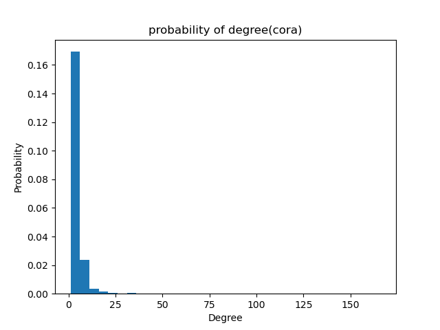
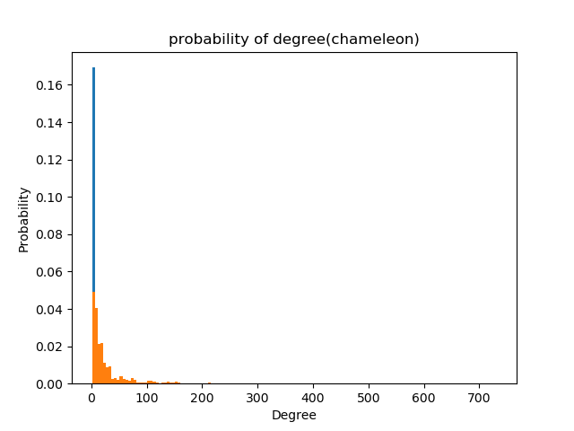
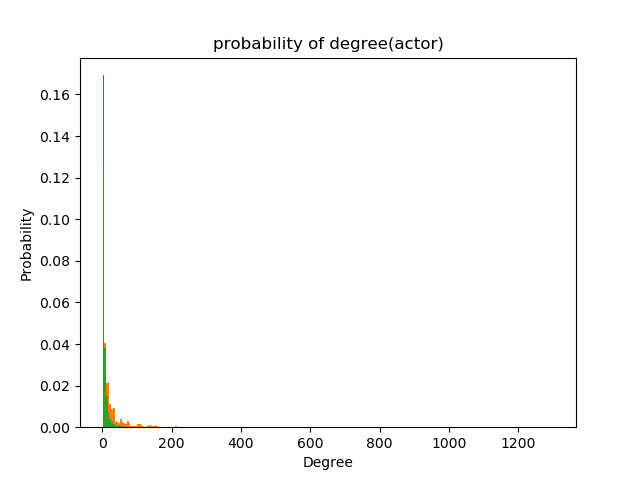

# 图数据挖掘 第一次作业

## 1 代码的运行方法

### 1.0 数据分析任务的运行

1. 运行**DataTransform.py**
2. 运行**DataProcess.py**
3. 运行**DatasetAnalysis.py**


### 1.1 Deepwalk Model的运行

1. 运行**DataTransform.py**
2. 运行**DataProcess.py**
3. 如果要进行重新训练model，运行**Deepwalk.py**
4. 运行**Classification.py**，在其最下方选择需要进行classification的数据集，注释掉对其他数据集分类的代码后运行，得到**macro $F_1$ score**

### 1.2 Node2Vec Model的运行

1. 运行**DataTransform.py**
2. 运行**DataProcess.py**
3. 如果要进行重新训练model，运行**Node2Vec.py**
4. 运行**Classification.py**，在其最下方选择需要进行classification的数据集，注释掉对其他数据集分类的代码后运行，得到**macro $F_1$ score**

### 1.3 LINE Model的运行

1. 运行**DataTransform.py**
2. 运行**DataProcess.py**
3. 如果要重新训练model，在main函数中选择使用一阶临近或二阶临近（order=1 or order=2）以及要训练的数据集，运行**LineTrain.py**
4. 在main函数中选择使用的模型以及数据集，运行**Classification.py**，得到**macro $F_1$ score**

## 2 各个Model的详细情况

### 2.0 数据分析

#### 2.0.1 实验过程和结果

- 数据集的处理与转化

  - 将**edge_list.txt**转化为DGLgraph对象，这部分具体操作详见**2.1.1**中的叙述。
  - 由于在计算节点的聚集系数时，需要知道该节点所有相邻节点之间的相邻关系，为方便，在DatasetAnalysis.py中预先得到一个neighbor_dict，记录每个节点的全部相邻节点。

- 节点度数、平均节点度数以及平均节点聚集系数的计算方法

  - DGLgraph对象提供了in_degrees()方法，可以得到每个节点的入度（度数）（无向图中无向边由两条相反方向的有向边表示，出度=入度=度数），全部加和除以节点总数即得到平均节点度数。

  - 对于每个节点，通过neighbor_dict得到其全部相邻节点，再根据neighbor_dict查找其中相邻的节点对数，通过
    $$
    C_i = \frac{2e_i}{k_i(k_i-1)}	\\
    其中k_i为节点i的相邻节点的个数，e_i为节点i的全部相邻节点中相邻节点对的数量。
    $$
    得到该节点的聚集系数，对全部节点的聚集系数求平均，即得到该图的平均聚集系数。

- 这里给出三个数据集的平均节点度数(degree)、度分布直方图（在./result中）、以及平均节点聚集系数(Convergence Factor)。

- 从上至下分别为cora、chameleon、actor dataset。

  ```
  Average degree of cora is 3.8980798721313477
  Average Convergence Factor of cora is 0.24067329850193728
  Average degree of chameleon is 27.554677963256836
  Average Convergence Factor of chameleon is 0.48135057608791076
  Average degree of actor is 7.015526294708252
  Average Convergence Factor of actor is 0.08019255113574139
  ```

  

  

  

#### 2.0.2 实验中出现的问题

- 需要注意在数据集的edge_list.txt中以及DGLgraph中，一条无向边都是由两条反向的有向边表示的，因此计算节点度数时，并非“节点度数=入度+出度”，而是“节点度数=入度=出度”；
- 同样，在计算聚集系数时，要注意在neighbor_dict中既存在“a为b的相邻节点”，也存在“b为a的相邻节点”，在计算相邻节点之间有多少连边时要注意不要重复计数两次。


### 2.1 DeepWalk

#### 2.1.1 实验过程和结果

- 数据集的处理和转化
    - 首先，为了能直接用pandas包更方便地读取一些数据，在**DataTransform.py**实现了一些对**edge_list.txt**的处理，转成了带列名的**edge_list.csv**
    - 然后，对每个dataset读入数据，在**DataProcess.py**处理成了**DGLgraph对象**,下面分别是cora,chameleon和actor转化后得到的DGLgraph
    ```
    Graph(num_nodes=2708, num_edges=10556,
      ndata_schemes={'feat': Scheme(shape=(1433,), dtype=torch.int32), 'label': Scheme(shape=(), dtype=torch.int32), 'train_mask': Scheme(shape=(), dtype=torch.bool), 'val_mask': Scheme(shape=(), dtype=torch.bool), 'test_mask': Scheme(shape=(), dtype=torch.bool)}
      edata_schemes={})
    Graph(num_nodes=2277, num_edges=62742,
        ndata_schemes={'feat': Scheme(shape=(2325,), dtype=torch.int32), 'label': Scheme(shape=(), dtype=torch.int32), 'train_mask': Scheme(shape=(), dtype=torch.bool), 'val_mask': Scheme(shape=(), dtype=torch.bool), 'test_mask': Scheme(shape=(), dtype=torch.bool)}
        edata_schemes={})
    Graph(num_nodes=7600, num_edges=53318,
        ndata_schemes={'feat': Scheme(shape=(932,), dtype=torch.int32), 'label': Scheme(shape=(), dtype=torch.int32), 'train_mask': Scheme(shape=(), dtype=torch.bool), 'val_mask': Scheme(shape=(), dtype=torch.bool), 'test_mask': Scheme(shape=(), dtype=torch.bool)}
        edata_schemes={})
    ```
- 对DeepWalk框架下的图结点表示的训练
在**Deepwalk.py**中对图上所有结点，每个结点进行**walk_num_per_node**次的random walk,在每次random walk的path中，在**win_size**大小的windows下选出输入skip-gram model的**[src, dst]** pair用于训练，skip-gram model在**Model.py**中实现，使用给定dataset生成的graph，以**SparseAdam**作为optimizer，对skip-gram model采用了negative sampling的训练方法以加快训练速度，进行**batch_size = 10, embed_dim = 64**的**120 epochs**的训练，最后得到的loss最低的model存在**./out/dataset_name**文件夹下的各个**deepwalk_ckpt**中
- 对已经生成的图结点的向量表示进行分类
在**Classification.py**中对已经被embed成向量的图结点进行分类任务的训练。
    - 首先读入各个结点的label，转化成**one-hot vector**的形式
    - 然后用一层全连接层加上softmax作为classifier，用graph中的**train_mask**包含的结点作为训练数据，**val_mask**包含的结点作为每个训练epoch中的测试
    - 训练完后在**test_mask**包含的结点下进行分类测试，得到**macro $F_1$ score**作为评测指标，下面从上至下分别为cora、chameleon、actor dataset下的**macro $F_1$ score**
    ```
    Testing dataset: f1 = 0.6340
    Testing dataset: f1 = 0.5120
    Testing dataset: f1 = 0.3011
    ```
    - classifier model训练完之后model也保存在了**./out/dataset_name**文件夹下，命名为dataset_name_deepwalk_classification_ckpt。

### 2.2 Node2Vec

#### 2.2.1 

- 数据集的处理和转化。
   - 这一部分处理与Node2Vec相同，不再赘述。

- 模型的构建
    - 由于Node2Vec与DeepWalk算法的继承性，二者在游走序列的生成、Model的构建、训练pair的选择上大致相同，Node2Vec算法中调用DeepWalk的SkipGram网络进行游走序列的对应训练。
    - 二者的区别在于游走序列的生成算法。Node2Vec通过两个超参数p与q对游走的规则进行限制。对于初始节点t与当前游走节点v，x为v相邻的节点，有如下规则：
        - 如果新节点与t相同，则x的采样概率为1/p。
        - 如果新节点与t相邻，则x的采样概率为1。
        - 如果新节点与t不相邻，则x的采样概率为1/q。
    - 总结来说，p决定了构建游走序列时回到初始点的倾向，q决定了向外游走时的BFS或DFS倾向。
    
- 在**Node2Vec.py**中实现，对应规则游走序列的生成与训练过程的完成。训练使用的超参数在Dataset.py的config结构中，p、q暂定为2。

- 在**Classification.py**中对已经被embed成向量的图结点进行分类任务的训练，并使用测试集计算其**macro $F_1$ score**，该过程同样与前两个Model相同。

- 从上至下分别为cora、chameleon、actor dataset。

  ```
    Testing dataset: f1 = 0.6222
    Testing dataset: f1 = 0.4649
    Testing dataset: f1 = 0.2492
  ```

    - classifier model训练完之后model也保存在了**./out/dataset_name**文件夹下，命名为dataset_name_node2vec_classification_ckpt。

       

### 2.3 LINE

#### 2.3.1 实验过程和结果

- 数据集的处理和转化，这一部分处理与前两个Model相同，不再赘述。

- LINE算法中定义了两种相似度

  - 一阶相似度用于描述图中成对顶点之间的局部相似度，形式化描述为若 ![[公式]](https://www.zhihu.com/equation?tex=u) , ![[公式]](https://www.zhihu.com/equation?tex=v) 之间存在直连边，则边权 ![[公式]](https://www.zhihu.com/equation?tex=w_%7Buv%7D) 即为两个顶点的相似度，若不存在直连边，则1阶相似度为0。 如上图，6和7之间存在直连边，且边权较大，则认为两者相似且1阶相似度较高，而5和6之间不存在直连边，则两者间1阶相似度为0。
  - 二阶相似度用于描述两个节点未必直连边，但存在多个相同的邻居节点时的相似度，形式化定义为，令 ![[公式]](https://www.zhihu.com/equation?tex=p_u%3D%28w_%7Bu%2C1%7D%2C...%2Cw_%7Bu%2C%7CV%7C%7D%29) 表示顶点 ![[公式]](https://www.zhihu.com/equation?tex=u) 与所有其他顶点间的1阶相似度，则 ![[公式]](https://www.zhihu.com/equation?tex=u) 与 ![[公式]](https://www.zhihu.com/equation?tex=v) 的2阶相似度可以通过 ![[公式]](https://www.zhihu.com/equation?tex=p_u) 和 ![[公式]](https://www.zhihu.com/equation?tex=p_v) 的相似度表示。若![[公式]](https://www.zhihu.com/equation?tex=u)与![[公式]](https://www.zhihu.com/equation?tex=v)之间不存在相同的邻居顶点，则2阶相似度为0。
  - 根据建议，分别采用两种相似度训练了两个LINE Model。

- LINE支持对带权图的训练（尽管所给的三个数据集中没有边权），但由于在直接使用梯度下降方法时，边权会直接乘在梯度上，导致当图中边权方差较大时，很难选择一个合适的学习率。因此，希望采用某种方式使得所有边权相同。一种方法就是从原始的带权边中进行采样，每条边被采样的概率正比于原始图中边的权重。这样既满足了边权相同的要求，也没有增加太多存储开销。在这里使用的是Alias算法（O(1)时间复杂度的离散抽样算法）进行采样。

  - 这里因为edge_list.txt中定义的边没有权值，故所有权值默认为1。

- 在**LineTrain.py**中实现，使用给定dataset生成的graph，以SparseAdam作为optimizer，对LINE model同样可以采用negative sampling的训练方法来提高效率，进行batch_size = 10, embed_dim = 64的120 epochs的训练，最后得到的loss最低的model存在./out/dataset_name文件夹下，命名为“$dataset_name$\_line_1(or 2)_ckpt”中

- 在**Classification.py**中对已经被embed成向量的图结点进行分类任务的训练，并使用测试集计算其**macro $F_1$ score**，该过程同样与前两个Model相同，这里只给出对于三个数据集分别采用一阶相似度与二阶相似度时的**macro $F_1$ score**。

- 从上至下分别为cora、chameleon、actor dataset。

  ```
    LINE Model：
    First-order proximity：
    Testing dataset: f1 = 0.4335
    Testing dataset: f1 = 0.5169
    Testing dataset: f1 = 0.2980
    Second-order proximity：
    Testing dataset: f1 = 0.4925
    Testing dataset: f1 = 0.5591
    Testing dataset: f1 = 0.2936
  ```

    - classifier model训练完之后model也保存在了**./out/dataset_name**文件夹下，命名为 “$dataset_name$\_line_1(or 2)_classification_ckpt”。

