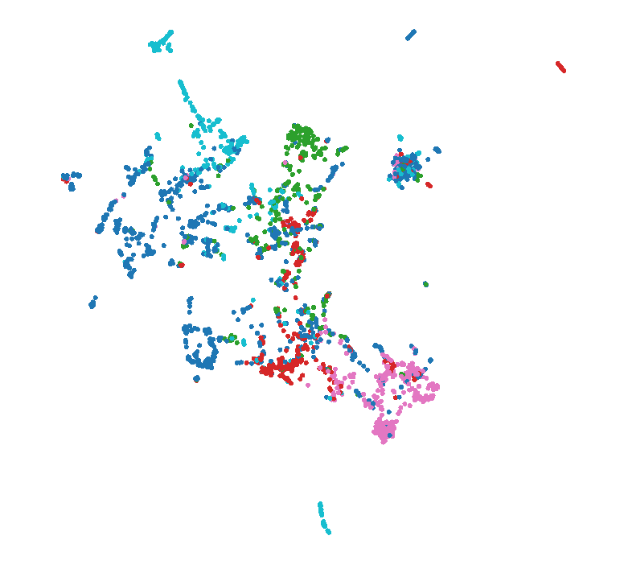
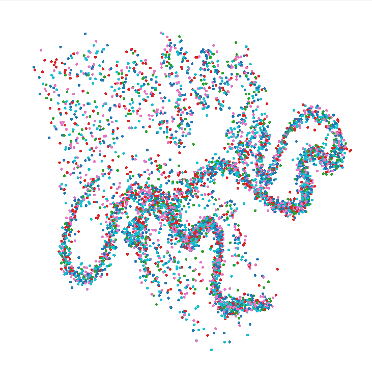

# 图数据挖掘 第三次作业

## 1 代码的运行方法

### 1.1 GCN model的运行

在**./hw3/GCN**目录命令行按如下要求输入指令运行即可：
```
python train.py + 参数


usage: train.py [-h] [--dataset DATASET] [--dropout DROPOUT] [--gpu GPU] [--lr LR] [--n-epochs N_EPOCHS] [--n-hidden N_HIDDEN] [--n-layers N_LAYERS] [--weight-decay WEIGHT_DECAY] [--self-loop]

optional arguments:
  -h, --help            show this help message and exit
  --dataset DATASET     Dataset name ('cora', 'chameleon', 'actor').
  --dropout DROPOUT     dropout probability
  --gpu GPU             gpu
  --lr LR               learning rate
  --n-epochs N_EPOCHS   number of training epochs
  --n-hidden N_HIDDEN   number of hidden gcn units
  --n-layers N_LAYERS   number of hidden gcn layers
  --weight-decay WEIGHT_DECAY
                        Weight of L2 loss
  --self-loop           graph self-loop (default=True)
```

若嫌麻烦，也可以直接在pycharm中直接运行**./hw3/GCN/train.py**,会代入默认参数进行运行

### 1.2 GAT model的运行

在**./hw3/GAT**目录下运行./hw3/GAT/GATTrain.py即可代入默认参数进行运行，其中包括训练过程以及对训练过后的模型的评估

### 1.3 Graphsage model的运行

在**./hw3/Graphsage**目录命令行按如下要求输入指令运行即可：

```
python train——full.py + 参数


usage: train.py [-h] [--dataset DATASET] [--dropout DROPOUT] [--gpu GPU] [--lr LR] [--n-epochs N_EPOCHS] [--n-hidden N_HIDDEN] [--n-layers N_LAYERS] [--weight-decay WEIGHT_DECAY] [--self-loop]

optional arguments:
  -h, --help            show this help message and exit
  --dataset DATASET     Dataset name ('cora', 'chameleon', 'actor').
  --dropout DROPOUT     dropout probability
  --gpu GPU             gpu
  --lr LR               learning rate
  --n-epochs N_EPOCHS   number of training epochs
  --n-hidden N_HIDDEN   number of hidden gcn units
  --n-layers N_LAYERS   number of hidden gcn layers
  --weight-decay WEIGHT_DECAY
                        weight of L2 loss
  --aggregator-type AGGREGATOR-TYPE
                        type of aggregator(default=gcn)
```

## 2 各个Model的详细情况和效果对比

### 2.1 GCN

#### 2.1.1 实验过程和结果

- 数据集的处理和转化
    - 首先，为了能直接用pandas包更方便地读取一些数据，在**DataTransform.py**实现了一些对**edge_list.txt**的处理，转成了带列名的**edge_list.csv**
    - 然后，对每个dataset读入数据，在**DataProcess.py**处理成了**DGLgraph对象**,下面分别是cora,chameleon和actor转化后得到的DGLgraph
      ```
      Graph(num_nodes=2708, num_edges=10556,
        ndata_schemes={'feat': Scheme(shape=(1433,), dtype=torch.int32), 'label': Scheme(shape=(), dtype=torch.int32), 'train_mask': Scheme(shape=(), dtype=torch.bool), 'val_mask': Scheme(shape=(), dtype=torch.bool), 'test_mask': Scheme(shape=(), dtype=torch.bool)}
        edata_schemes={})
      Graph(num_nodes=2277, num_edges=62742,
          ndata_schemes={'feat': Scheme(shape=(2325,), dtype=torch.int32), 'label': Scheme(shape=(), dtype=torch.int32), 'train_mask': Scheme(shape=(), dtype=torch.bool), 'val_mask': Scheme(shape=(), dtype=torch.bool), 'test_mask': Scheme(shape=(), dtype=torch.bool)}
          edata_schemes={})
      Graph(num_nodes=7600, num_edges=53318,
          ndata_schemes={'feat': Scheme(shape=(932,), dtype=torch.int32), 'label': Scheme(shape=(), dtype=torch.int32), 'train_mask': Scheme(shape=(), dtype=torch.bool), 'val_mask': Scheme(shape=(), dtype=torch.bool), 'test_mask': Scheme(shape=(), dtype=torch.bool)}
          edata_schemes={})
      ```
- 对GCN框架下的图结点表示和分类训练
根据设置的隐藏层层数**n_hidden**,设置了**n_hidden**层**dgl**框架内置实现的**GraphConv**层，并根据设定的**dropout**进行默认**200 epochs**的训练
  
    - 用graph中的**train_mask**包含的结点作为训练数据，**val_mask**包含的结点作为每个训练epoch中的测试
    - 训练完后在**test_mask**包含的结点下进行分类测试，得到正确分类的比例**test accuracy、macro $F_1$ score**作为评测指标，下面从上到下分别为cora、chameleon、actor dataset下的**test accuracy、macro $F_1$ score**
      ```
      Test accuracy 79.20% | F1 score 79.06%
      Test accuracy 43.20% | F1 score 39.45%
      Test accuracy 23.90% | F1 score 8.19%
      ```
    - GCN model训练完后model参数也保存在了**./hw3/out/dataset_name**文件夹下，命名为dataset_name_gcn_ckpt。

### 2.2 GAT

#### 2.2.1 实验过程和结果

- 数据集的处理和转化

  - 这部分与之前其他模型一致，不再详细说明

- GAT框架以及训练过程

  - 对GAT框架下的图结点表示和分类训练

  - 设置使用的Attention Head数量**num_heads**，根据设置的隐藏层层数**num_hidden**,设置了**n_hidden**层**dgl**框架内置实现的**GraphConv**层，并根据设定的**dropout**进行默认**learning rate = 0.02**，**200 epochs**的训练

  - 用graph中的**train_mask**包含的结点作为训练数据，**val_mask**包含的结点作为每个训练epoch中的测试

  - 训练完后在**test_mask**包含的结点下进行分类测试，得到正确分类的比例**test accuracy、macro $F_1$ score**作为评测指标，下面从上到下分别为cora、chameleon、actor dataset下的**test accuracy、macro $F_1$ score**

    ```
    Test accuracy 77.40% | F1 score 77.53%
    Test accuracy 53.73% | F1 score 54.25%
    Test accuracy 24.12% | F1 score 12.63%
    ```

  - 上述训练结果的GAT model参数保存在了**./hw3/out/#dataset_name#**文件夹下，命名为#dataset_name#_GAT_ckpt。

### 2.3 Graphsage

#### 2.3.1 实验过程和结果

- 数据集的处理和转化
  - 这一部分与GCN模型一致，这里不再赘述。

- 框架与训练

  - 根据设置的隐藏层层数**n_hidden**,设置了**n_hidden**层**dgl**框架内置实现的**SAGEConv**层，并根据设定的**dropout**进行默认**200 epochs**的训练。
  - 用graph中的**train_mask**包含的结点作为训练数据，**val_mask**包含的结点作为每个训练epoch中的测试
  - 训练完后在**test_mask**包含的结点下进行分类测试，得到正确分类的比例**test accuracy、macro $F_1$ score**作为评测指标，下面从上到下分别为cora、chameleon、actor dataset下的**test accuracy、macro $F_1$ score**
    ```
    Test Accuracy 79.40% | F1 score 78.94%
    Test Accuracy 42.76% | F1 score 34.67%
    Test Accuracy 23.90% | F1 score 7.72%
    ```
  - GraphSAGE model训练完后model参数也保存在了**./hw3/out/dataset_name**文件夹下，命名为dataset_name_graphsage_ckpt。
  
### 2.4 GCN、GAT、GraphSage的效果对比

#### 2.4.1 cora分类正确率对比

- 对于节点聚集系数最低、结构较为简单的cora数据集，三种方法的正确率如下，同时附第一次作业的三种方法的数据对比。
  ```
  Dataset cora:
  
  GCN:        Test accuracy 79.20% | F1 score 79.06%
  GAT:        Test accuracy 77.40% | F1 score 77.53%
  GraphSAGE:  Test Accuracy 79.40% | F1 score 78.94%

  Deepwalk:   f1 = 0.6340
  Node2Vec:   f1 = 0.6222
  LINE:       f1 = 0.4925
  ```
- 可以看到，三种图神经网络方法的区别不大，且显著优于浅层模型。

#### 2.4.2 chameleon分类正确率对比

- 对于chameleon数据集，三种方法的正确率如下，同时附第一次作业的三种方法的数据对比。
  ```
  Dataset chameleon:
  
  GCN:        Test accuracy 43.20% | F1 score 39.45%
  GAT:        Test accuracy 53.73% | F1 score 54.25%
  GraphSAGE:  Test Accuracy 42.76% | F1 score 34.67%

  Deepwalk:   f1 = 0.5120
  Node2Vec:   f1 = 0.4649
  LINE:       f1 = 0.5591
  ```
- 可以看到，GAT模型在三种模型中表现较好，且相较于浅层模型优势不大。

#### 2.4.3 actor分类正确率对比

- 对于网络结构最为复杂的actor数据集，三种方法的正确率如下，同时附第一次作业的三种方法的数据对比。
  ```
  Dataset actor:
  
  GCN:        Test accuracy 23.90% | F1 score 8.19%
  GAT:        Test accuracy 24.12% | F1 score 12.63%
  GraphSAGE:  Test Accuracy 23.90% | F1 score 7.72%

  Deepwalk:   f1 = 0.3011
  Node2Vec:   f1 = 0.2492
  LINE:       f1 = 0.2980
  ```
- 可以看到，图神经网络方法相较于浅层模型优势不大。

## 3 浅层模型和图神经网络模型的node embedding的可视化分析

### 3.1 可视化结果

- 使用tensorboard进行可视化操作，使用umap降维并导出二维的可视化结果。
#### 3.1.1 cora分类结果可视化

<table>
  <tr>
    <th> GCN </th>
    <th> GAT </th>
    <th> GraphSAGE </th>
  </tr>
  <tr>
    <td></td>
    <td></td>
    <td></td>
  </tr>
</table>
<table>
  <tr>
    <th> DeepWalk </th>
    <th> Node2Vec </th>
    <th> LINE </th>
  </tr>
  <tr>
    <td></td>
    <td></td>
    <td></td>
  </tr>
</table>

- 可以看到，对于表现较好的图神经网络部分，类与类之间有着较为清晰的界限，相较于浅层模型有更小的噪声与更好的聚类分离。由于集群的不稳定性和数据性质，部分点位于错误的颜色簇中。浅层模型则聚类分离不明显，准确定较差。
  
#### 3.1.2 chameleon分类结果可视化

<table>
  <tr>
    <th> GCN </th>
    <th> GAT </th>
    <th> GraphSAGE </th>
  </tr>
  <tr>
    <td></td>
    <td></td>
    <td></td>
  </tr>
</table>
<table>
  <tr>
    <th> DeepWalk </th>
    <th> Node2Vec </th>
    <th> LINE </th>
  </tr>
  <tr>
    <td></td>
    <td></td>
    <td></td>
  </tr>
</table>

- chameleon数据集从结果来看，图神经网络与浅层模型的表现相似。浅层模型是游走类的模型，对网络中节点的周围游走结构进行学习，而作业三中的网络对于节点的多层邻居之间的消息传递进行学习。网络复杂度增加时，浅层模型不能较好的反应局部结构，图神经网络中的消息传递特征不明显，二者的准确率均下降。
  
#### 3.1.3 actor分类结果可视化

<table>
  <tr>
    <th> GCN </th>
    <th> GAT </th>
    <th> GraphSAGE </th>
  </tr>
  <tr>
    <td></td>
    <td></td>
    <td></td>
  </tr>
</table>
<table>
  <tr>
    <th> DeepWalk </th>
    <th> Node2Vec </th>
    <th> LINE </th>
  </tr>
  <tr>
    <td></td>
    <td></td>
    <td></td>
  </tr>
</table>

- 可以看到，两种方法的准确率都较低。actor复杂度进一步提高，局部结构反而相较于信息传递方法有一定的优势。
- 
- 以actor数据集、gcn方法的三维分类图为例，可以直观的看到，学习到的表示方法不能较好的进行聚类与分类。


